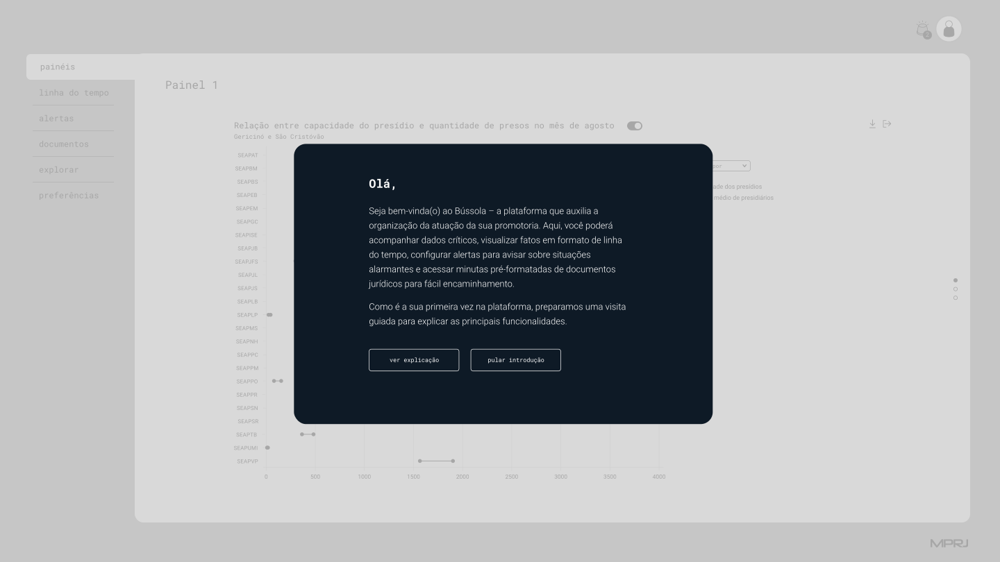
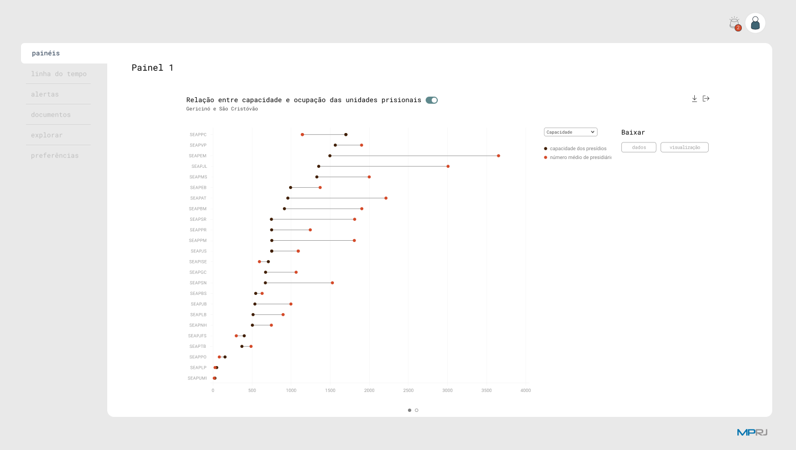
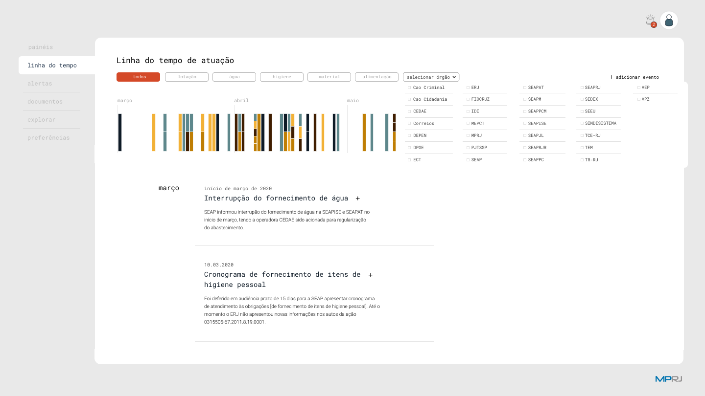
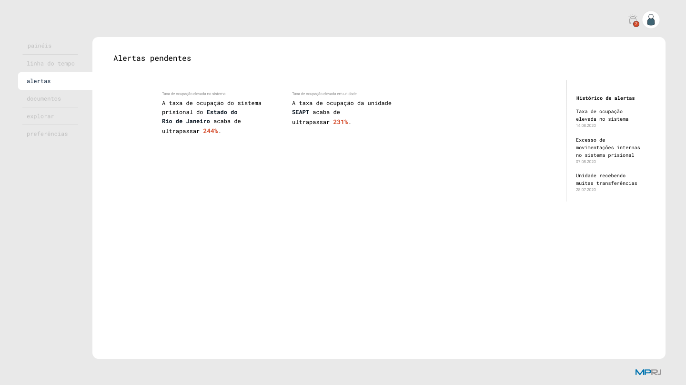
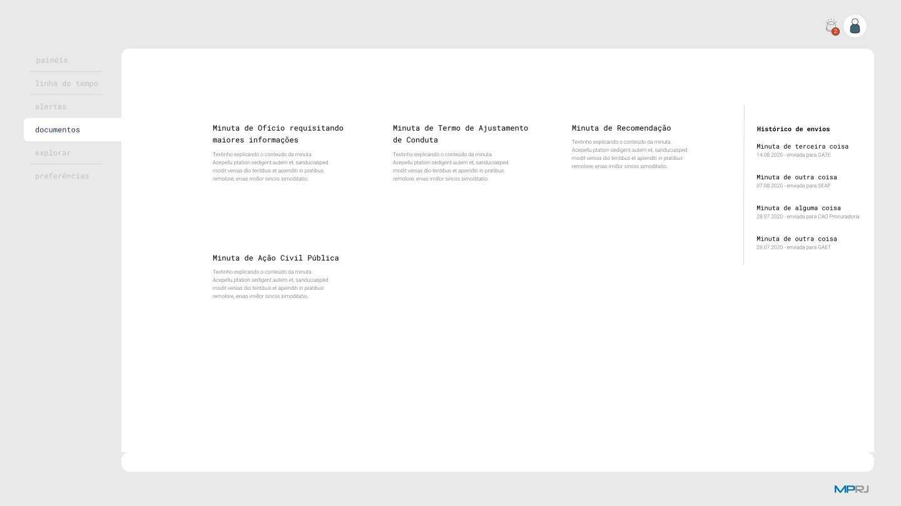
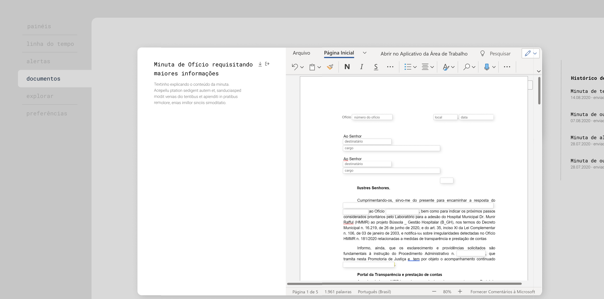

# Bússola

*transformando dados em ações custo-efetivas*

Este repositório concentra as referências para os diferentes componentes da plataforma Bússola, idealizada pelo [Laboratório de Inovação do Ministério Público do Estado do Rio de Janeiro](http://www.mprj.mp.br/inova) (Inova_MPRJ).

### Índice

- [O que é o Bússola?](#o-que-é-o-bússola)
- [Estrura do projeto](#estrutura-do-projeto)
- [Capturas de tela](#capturas-de-tela)
  - [Página de abertura](#página-de-abertura)
  - [Primeiro acesso](#primeiro-acesso)
  - [Painéis selecionados pelo usuário](#painéis-selecionados-pelo-usuário)
  - [Linha do tempo](#linha-do-tempo)
  - [Alertas](#alertas)
  - [Gestão de documentos](#gestão-de-documentos)
- [Licenças](#licenças)
- [Contato e contribuições para o projeto](#contato-e-contribuições-para-o-projeto)

## O que é o Bússola?

O projeto Bússola tem como objetivo promover a transparência de dados públicos e oferecer ferramentas para que gestores e órgãos de controle tomem decisões efetivas sobre políticas públicas.

Conduzida segundo o [Fluxo de Transformação](https://www.mprj.mp.br/inova/fluxotransformacao), a criação de uma *bússola* passa por diversas etapas:

1. Identificação de uma demanda relacionada ao monitoramento e melhoria na prestação de serviços públicos.
1. Contato e mobilização de atores envolvidos com a execução, avaliação e fiscalização do serviço.
1. Pesquisa colaborativa de melhores práticas de monitoramento aplicadas ao serviço.
1. Seleção de gestores e unidades prototipadores.
1. Priorização de indicadores críticos e abertura de dados.
1. Criação da arquitetura de coleta contínua dos dados nas unidades que prestam o serviço público.
1. Disponibilização dos dados para a sociedade, para os gestores e para os órgãos de controle, por meio de plataforma gerencial e de painéis explicativos.

Atualmente, há três *bússolas* em construção:

- **Bússola _ Gestão Hospitalar**: Acompanha a prestação de serviços de saúde por unidades hospitalares - inicialmente, em dois hospitais municipais da rede de saúde de Volta Redonda (RJ). Saiba mais [aqui](https://www.mprj.mp.br/inova/gestaohospitalar).
- **Bússola _ Baía da Guanabara**: Acompanha a execução das obras de despoluição da bacia hidrográfica da Baía da Guanabara, a partir de dois termos de ajustamento de conduta firmados entre o MPRJ, o Governo do Estado do Rio de Janeiro e a CEDAE. Saiba mais [aqui](http://www.mprj.mp.br/inova/baiaguanabara).
- **Bússola _ Sistema Prisional**: Acompanha dados do sistema prisional do estado do Rio de Janeiro, como lotação e atendimento de necessidades básicas dos internos. Saiba mais [aqui](https://www.mprj.mp.br/inova/sistemaprisional).

## Estrutura do projeto

Praticamente todo o código-fonte utilizado na extração dos dados das unidades monitoradas e na construção da plataforma deve ser progressivamente disponibilizado em repositórios no [perfil do Inova_MPRJ](https://github.com/Inova-MPRJ) no GitHub. Com isso, qualquer pessoa interessada pode verificar em detalhes o funcionamento das ferramentas, realizar modificações e reutilizá-las para suas próprias finalidades, de acordo com os termos das [licenças](#licenças).

Atualmente, são públicos os seguintes repositórios do projeto:

- **Este [meta-repositório](https://github.com/Inova-MPRJ/bussola)**, que concentra as informações gerais relativas ao projeto e referências para os demais repositórios.
- **Repositório [bussola-backend](https://github.com/Inova-MPRJ/bussola-backend)**: contém os códigos das interfaces de programação (APIs) que disponibilizam os dados para consumo pela plataforma.
- **Repositório [bussola-etl-prisional](https://github.com/Inova-MPRJ/bussola-etl-prisional)**: contém ferramenta de linha de comando para extração, transformação e carregamento de dados de ocupação das unidades prisionais do estado do Rio de Janeiro, fornecida por meio de boletins semanais pela Secretaria de Estado da Administração Penitenciária do Rio de Janeiro (SEAP/RJ).
- **Repositório [bússola-etl-siafe](https://github.com/Inova-MPRJ/bussola-etl-siafe)**: contém ferramenta de linha de comando para extração, transformação e carregamento de dados orçamentários e financeiros do estado do Rio de Janeiro.

Além desses repositórios, o repositório **[inova-sites](https://github.com/Inova-MPRJ/inova-sites)** contém os códigos-fonte das páginas web desenvolvidas pelo Laboratório de Inovação - incluindo as páginas dos relatórios sobre as diferentes *bússolas* em andamento.

## Capturas de tela

O diretório [`./assets/screenshots`](./assets/screenshots) contém uma série de capturas de tela retiradas do protótipo clicável da platatorma:

### Página de abertura

### Primeiro acesso

### Painéis selecionados pelo usuário

### Linha do tempo

### Alertas

### Gestão de documentos

## Licenças

Todos os materiais disponibilizados neste repositório e nos demais repositórios associados ao projeto Bússola são disponibilizados publicamente sob **licenças livres, com atribuição**.

Em outras palavras, você é livre para compartilhar e adaptar qualquer material nesses repositórios, sem necessidade de solicitar qualquer autorização adicional, desde que cumpra algumas regras simples:

- Ao reutilizar o material disponibilizado, dê os devidos créditos ao `Laboratório de Inovação do Ministério Público do Estado do Rio de Janeiro <http://www.mprj.mp.br/inova>` (o link para o site do Inova_MPRJ pode ser substituído pelo link do repositório de onde você retirou o material).
- Ao adaptar ou redistribuir o material, indique as alterações realizadas e *de forma alguma sugira que o Inova_MPRJ ou o Ministério Público do Estado do Rio de Janeiro endossam você ou o seu uso*.

As licenças específicas aplicáveis dependem da natureza de cada material:

- Os códigos-fonte de scripts, funções e demais trechos de código de programação são disponibilizados sob [licença Apache 2.0](https://www.apache.org/licenses/LICENSE-2.0).
- Os dados fornecidos ao MPRJ (e por ele anonimizados, quando é o caso) são públicos nos termos da [Lei de Acesso à Informação](http://www.planalto.gov.br/ccivil_03/_ato2011-2014/2011/lei/l12527.htm). Adicionalmente, os dados produzidos ou consolidados pelo Inova_MPRJ são disponibilizados sob licença [Open Data Commons Attribution 1.0](https://opendatacommons.org/licenses/by/1-0/) (ODC-By 1.0).
- Demais materiais criativos, como ícones, imagens e registros audiovisuais, são disponibilizados sob licença [Creative Commons Atribuição 4.0 Internacional](https://creativecommons.org/licenses/by/4.0/deed.pt_BR) (CC-BY 4.0).

Para saber a licença aplicável a um arquivo específico, consulte, nesta ordem: (1) o ícone, cabeçalho ou rodapé com a referência da licença no arquivo; (2) o arquivo de licença (arquivo `LICENSE` ou `LICENSE.md`) contido no mesmo diretório do material em questão; e (3) os arquivos de licença contidos nos diretórios imediatamente superiores, até chegar na raíz do repositório.

## Contato e contribuições para o projeto

Com a evolução do projeto, o Inova_MPRJ pretende contar com a colaboração de pessoas e instituições interessadas em contribuir com o desenvolvimento da plataforma.

Por enquanto, porém, a melhor forma de propor um trabalho em conjunto ou se comunicar conosco é por meio do e-mail do Laboratório: [inova@mprj.mp.br](mailto:inova@mprj.mp.br)
